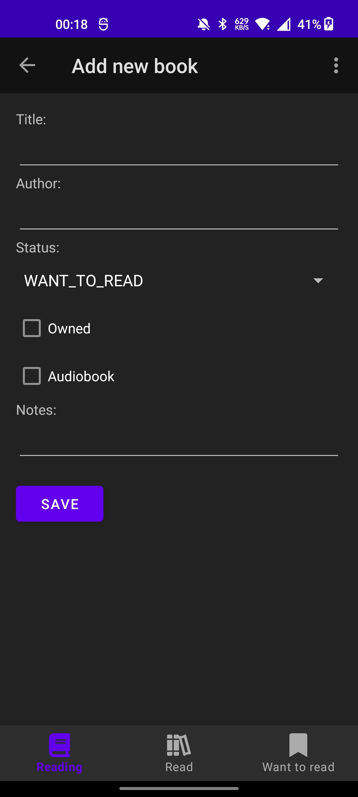

# Mini Project Library


Track your favorite books on your phone.

## APK

There are _Debug APKs_ (**library-debug-\$date.apk**) and _Release APKs_ (**library-release-\$date.apk**) under following link:

- [Packages](https://gitlab.ti.bfh.ch/bigla2/android_programming/-/packages/939)

## Signing

The packages are signed only with the **Signature Scheme V2** and not with the scheme v1.
To verify the APK signature, you have to use the `apksigner` binary instead of `jarsigner` binary.

Verify signature:

```bash
apksigner verify --verbose library-release-2023-05-19_2259.apk
```

## How to use

### Export and Import data

You can use the provided test data file here if you want:
**20_Library/app/src/main/java/com/example/library/testData/books.json**

Just put it somewhere on your phone and import it from the app.


### Different tabs depending on book status


### Add a new book



### Edit an existing book


## Credits

Thanks to Jan Fuhrer for helping me with CI/CD.

## Disclaimer

The data flow of this application is horrible I know.
I just wanted to do something as simple as possible.
In the future I would like to extend this and switch to an API.
Also, I need to learn quite a bit of Android UI logic and best practices.